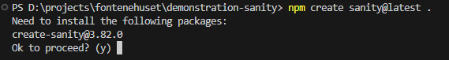
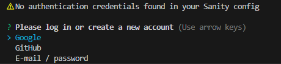
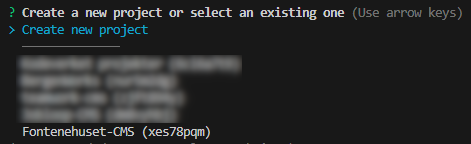
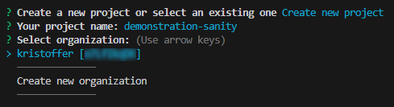
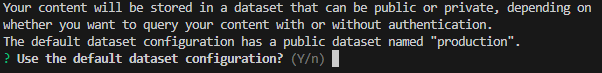
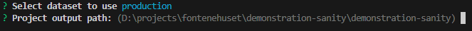
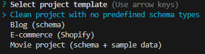
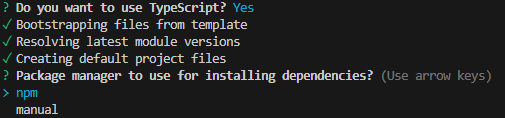

# Sanity studio
Sanity er et content management system (CMS) som gjør det veldig lett å ligge inn, og hente ut data. Sanity tillater enkel behandling av data når oppsettet er ferdig, dette er veldig kjekt for brukere som ikke er kjent eller god til koding.

## Registrer en konto hos sanity.io
Aller først må vi sitte opp en konto hos [sanity.io](https://www.sanity.io) som du kan bruke til å holde styr på dine prosjekter og studioer. Hvis du ikke allerede har en sanity konto kan du registrere en her: https://www.sanity.io/login/sign-up

> [!NOTE]
> Hvis du bruker social logins så husk at du har forskjellig bruker utifra hvilken provider du velger, husk å bruk samme provider senere!

## Installer Sanity Studio lokalt
Vi begynner først med å installere Sanity Studio i en tom mappe, hvor `.` på slutten sier at vi ønsker å bruke aktiv mappe som installasjon mål.
```console
npm create sanity@latest .
```



Etter dette får du valget om å logge inn i sanity med credentials du satte opp din sanity.io konto med.



Videre kan du velge å bruke et eksisterende prosjekt (henter ned detaljer automatisk) eller lage et nytt prosjekt. I dette eksempelet lager jeg et nytt prosjekt



Hvis du velger å lage et nytt prosjekt får du valget om å knytte dette mot en organisasjon, eller på din egen bruker. Anbefaler å bare bruke din egen bruker hvis den eksisterer.



Hvis du valgte nytt prosjekt må du også fortelle sanity hva hoved databasen din skal hete, i eksempelet bruker vi `production` som er default



Sanity Studio krever at du installerer det i en tom mappe, hvis den aktive folderen din inneholder andre filer må du lage en ny tom mappe. Du trenger ikke å skrive noe inn i dette steget, du kan bare trykke `enter` og bruke default



Videre får du valget om å bruke forhåndsinstillinger for innholdet ditt, vi kommer til å begynne med `clean project` aka et tomt prosjekt



Siste valget er om du ønsker å bruke typescript og valg av package manager, her bruker vi som regel `npm`



Etter du har kjørt disse kommandoenene så vill du se at mange dependencies og mapper blir opprettet (Fil forklaring [her](https://www.sanity.io/docs/project-structure)). Sanity Studio genererer også en React prosjekt som vi gjør at vi kan redigere data på en enklere måte i nettleseren.

Det er mulig å kunne sende [API requests](https://www.sanity.io/docs/http-api) for å lage, lese, endre og slette (CRUD), men vi kommer til å forholde oss til websiden for all redigering i dette eksempelet.

Etter du har installert Sanity Studio får du også tilgang til [Sanity CLI](https://www.sanity.io/docs/cli) i terminalen / kommandolinjen

> [!NOTE]
> Du kan finne mer grunndig informasjon om installerings prosessen på [sanity.io/docs](https://www.sanity.io/docs/installation)

# Hvordan sitter man opp skjema for data
> [!NOTE]
> Du kan finne mer grunndig informasjon om planlegging av database modeller i sanity på [sanity.io/content-modeling](https://www.sanity.io/content-modeling)

Etter du har installert Sanity Studio fra seksjonen over kan vi begynne å definere et nytt `schema` (database-model). Tilgjengelige felter kan du finne på [sanity.io/docs/schemas-and-forms](https://www.sanity.io/docs/schemas-and-forms)

```js
// ./schemas/example.ts
export default {
  name: 'example',
  title: 'Eksempel person skjema',
  type: 'document',
  fields: [
    {
      name: 'name',
      title: 'Navn',
      type: 'string',
    },
    {
      name: 'age',
      title: 'Alder',
      type: 'number',
    }
  ]
}
```

Når du har lagd et nytt skjema må vi inkludere dette i `schemaTypes\index.ts` for at Sanity Studio skal importere dette riktig.

```ts
// ./schemas/index.ts
import example from "./example"

export const schemaTypes = [
  example
]
```
Hvis du lurer på hvor disse filene blir brukt så er det i `sanity.cli.ts` og `sanity.config.ts` slik at Studio tilgang
```ts
import { defineConfig } from 'sanity'
import { structureTool } from 'sanity/structure'
import { visionTool } from '@sanity/vision'
import { schemaTypes } from './schemaTypes'

export default defineConfig({
  name: 'default',
  title: 'demonstration-sanity',

  projectId: 'r4fonqs3',
  dataset: 'production',

  plugins: [structureTool(), visionTool()],

  schema: {
    types: schemaTypes, // <-- her blir skjema importert
  },
})
```
Når du har lagret disse filene kan du starte sanity studio ved å kjøre og besøke ditt studio i nettleseren på http://localhost:3333/
```console
npm run dev
```

# Mer info om schemas
wip

# Ekstra funksjonalitet: components / plugins
Av og til møter man på situasjoner der du trenger funksjonalitet som ikke er innebygget i Sanity Studio, da har man muligheten til enten å lage sine egene [React komponenter](https://www.sanity.io/docs/studio-components) eller å installere [plugins](https://www.sanity.io/plugins)

# Hvordan bruker jeg data i min app?
wip